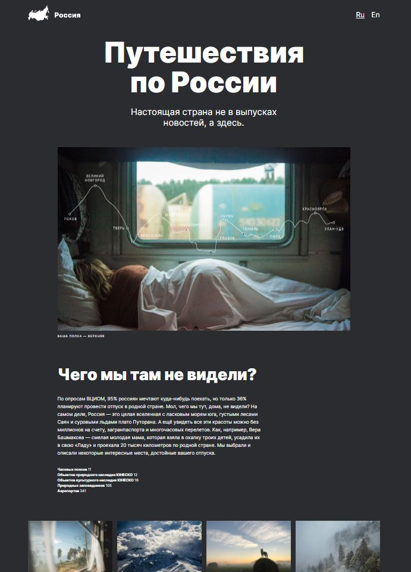
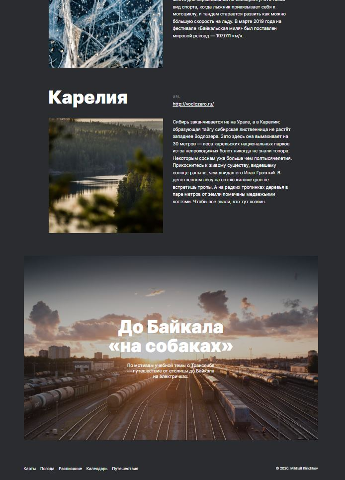

# Путешествие по России
_______________

## Описание
Проект предназначен для практического применения навыков адаптивной верстки, и представляет собой единую страницу, описывающую различные примечательные места России.
В проекте использованы основные техники, использующиеся при работе с HTML и CSS, grid-layout, сторонний код *normalize.css, шрифт Inter*.
Основная цель проекта - развитие навыков по адаптивной верстке, гридам и работе с Figma.
Код и структура файлов в проекте организованы согласно положениям БЭМ.

  
  

## Планы по доработке
1. Дополнительные точки перелома в адаптиве.
2. Рабочее переключение языков.

### Ссылка на проект
https://ihomeeer.github.io/russian-travel/
